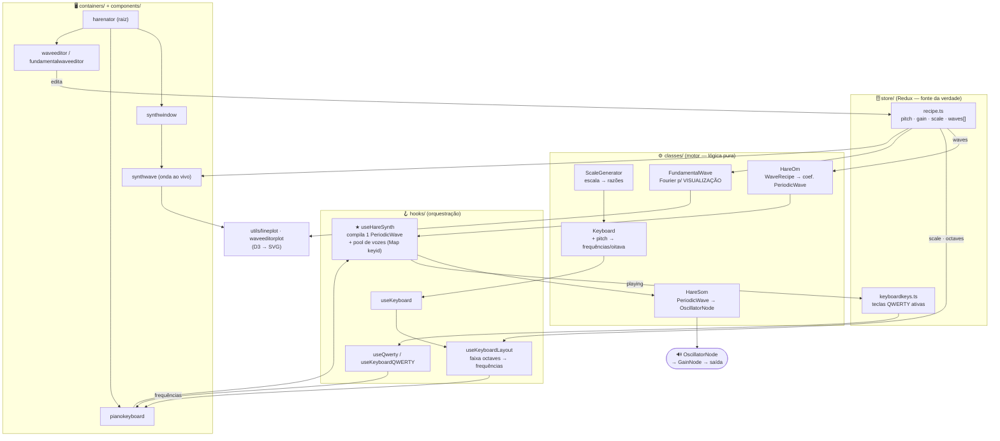
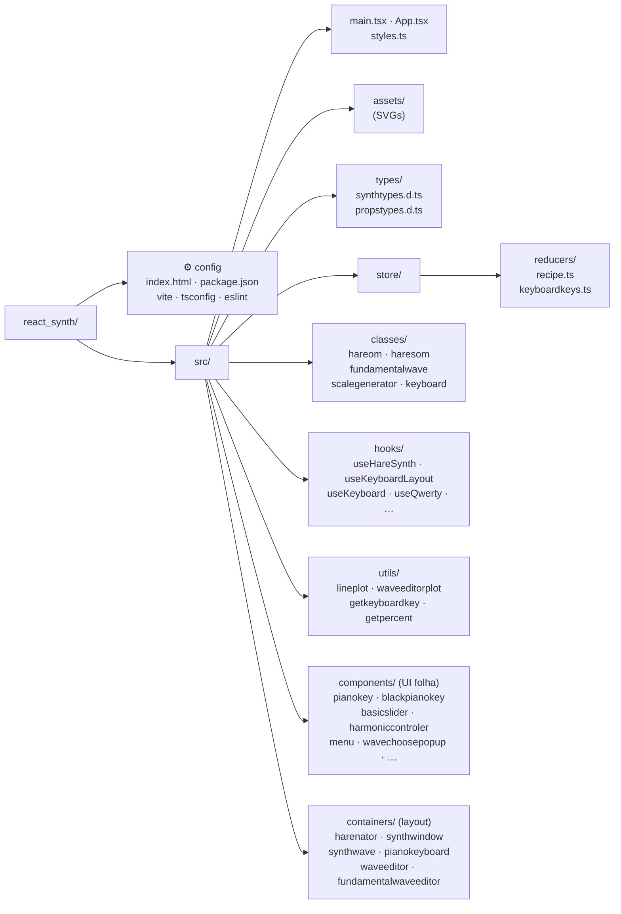

# Arquitetura — harenator

Sintetizador musical para web (síntese aditiva via séries de Fourier) construído com
React 18 + TypeScript + Vite, Redux Toolkit, styled-components, D3 e a Web Audio API nativa.

O ponto central não óbvio: o áudio **não** é transmitido quadro a quadro nem pré-renderizado
em PCM — quando a `recipe` muda, `useHareSynth` compila o timbre uma vez num `PeriodicWave`
(independente da nota), e tocar uma tecla apenas dispara um `OscillatorNode` leve nessa
frequência. Motivação e trade-offs dessa escolha:
**[ADR-0003](adr/0003-sintese-por-oscilador-nativo.md)** (substitui o ADR-0001).

## 1. Esquema de arquivos e diretórios

```
react_synth/
│
├── Configuração raiz
│   ├── index.html                  ← ponto de entrada HTML
│   ├── package.json                ← deps e scripts (dev/build/lint/preview)
│   ├── vite.config.ts              ← config do Vite
│   ├── tsconfig*.json              ← TS (app / node / base)
│   ├── eslint.config.js
│   ├── CLAUDE.md · README.md
│
├── docs/
│   ├── arquitetura.md              ← este documento (mapa + fluxo + camadas)
│   ├── pipeline-audio.md           ← receita → PeriodicWave → OscillatorNode
│   ├── keyboard.md                 ← vínculo posicional frequência ↔ teclas
│   ├── stacks.md                   ← dependências, versões e papéis
│   ├── testes.md                   ← pirâmide, escopo testável e convenções
│   └── adr/                        ← decisões arquiteturais (índice + ADRs)
│
└── src/
    ├── main.tsx                    ← bootstrap React + Redux Provider
    ├── App.tsx                     ← raiz da árvore de componentes
    ├── styles.ts                   ← estilos globais
    ├── vite-env.d.ts
    │
    ├── assets/                     ← ícones SVG (all, change, close, up/down, plus/minus)
    │
    ├── types/                      ← tipos ambientes globais (sem import)
    │   ├── synthtypes.d.ts         ← SynthRecipe, WaveRecipe…
    │   └── propstypes.d.ts         ← tipos de props
    │
    ├── store/                      ← REDUX (fonte da verdade)
    │   ├── index.ts                ← configureStore
    │   └── reducers/
    │       ├── recipe.ts           ← pitch, gain, scale, waves[]  ◄── o som
    │       └── keyboardkeys.ts     ← teclas QWERTY pressionadas
    │
    ├── classes/                    ← MOTOR de síntese (lógica pura)
    │   ├── hareom.ts               ← WaveRecipe → coeficientes de PeriodicWave (timbre)
    │   ├── haresom.ts              ← toca um PeriodicWave num OscillatorNode (reprodução)
    │   ├── fundamentalwave.ts      ← síntese aditiva (Fourier) p/ VISUALIZAÇÃO do editor
    │   ├── scalegenerator.ts       ← escala → razões de frequência
    │   └── keyboard.ts             ← + pitch → frequências absolutas/oitava
    │
    ├── hooks/                      ← LÓGICA reutilizável / orquestração
    │   ├── useHareSynth.ts         ★ motor de áudio: compila timbre + pool de vozes
    │   ├── useKeyboardLayout.ts    ← faixa recipe.octaves → frequências tocáveis
    │   ├── useKeyboard.ts          ← monta keyboard[oitava][nota]
    │   ├── useQwerty.ts / useKeyboardQWERTY.ts  ← input do teclado físico
    │   ├── usePitchChange.ts
    │   ├── useWaveEditorState.ts · useFundamentalWaveView.ts
    │   ├── useMainWaveView.ts · useComponentSizes.ts
    │   ├── useWindowsSize.ts · useInfoBtn.ts
    │
    ├── utils/                      ← helpers
    │   ├── lineplot.tsx · waveeditorplot.tsx   ← visualização D3/SVG
    │   ├── getkeyboardkey.ts · getpercent.ts
    │
    ├── components/                 ← UI folha (cada um: index.tsx + styles.ts)
    │   ├── pianokey/ · blackpianokey/        ← teclas
    │   ├── basicslider/ · harmoniccontroler/ ← controles de parciais
    │   ├── keyboardvolume/ · menu/
    │   ├── wavechoosepopup/ · waveeditorheader/
    │   └── svgcontainer/
    │
    └── containers/                 ← LAYOUT / orquestração de UI
        ├── harenator/              ← container raiz da app
        ├── synthwindow/            ← janela principal do sintetizador
        ├── synthwave/              ← forma de onda resultante (ao vivo)
        ├── pianokeyboard/          ← teclado tocável
        ├── waveeditor/             ← editor de waves
        └── fundamentalwaveeditor/  ← editor de uma fundamental
```

## 2. Arquitetura e fluxo de dados



## 3. Estrutura de diretórios



## 4. Camadas e responsabilidades

| Camada | Pasta | Papel |
|--------|-------|-------|
| Estado | `store/` | O que o som **é** (recipe) + teclas ativas |
| Motor | `classes/` | A **matemática** (timbre, escalas, afinação, reprodução) |
| Orquestração | `hooks/` | Compila o timbre, gerencia áudio e input |
| Apresentação | `components/` / `containers/` | UI folha vs. layout |
| Auxiliares | `utils/` / `types/` / `assets/` | Plotagem, tipos globais, ícones |
