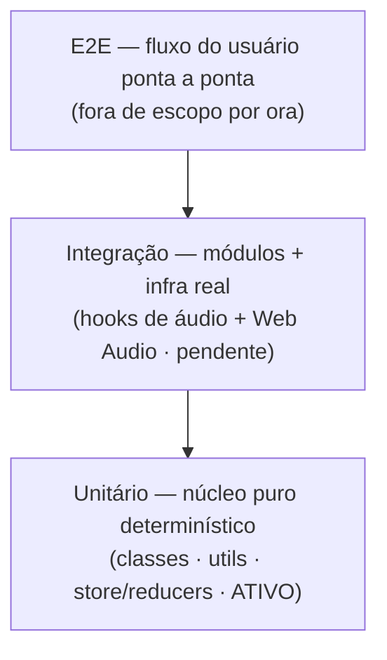

# Testes — harenator

Referência canônica de testes do projeto. O subagente `qa-tester` traz as **regras gerais**
de decisão (que camada testar, como descobrir o que testar, como auditar testes existentes);
este documento traz o que é **volátil ou detalhado demais** para viver no agente: a pirâmide
aplicada ao harenator, o **mapa vivo** do que é testável hoje + roadmap, e as **convenções
concretas** de implementação. Os dois trabalham juntos para manter a suíte saudável conforme
o projeto se transforma.

Para versões das stacks de teste, veja `docs/stacks.md`. Para o fluxo de dados e camadas,
`docs/arquitetura.md`.

## 1. A pirâmide de testes no harenator

A pirâmide organiza os testes por granularidade, velocidade e custo: muitos testes baratos e
rápidos na base, poucos caros e lentos no topo. Teste sempre na **camada mais barata** que
prova o contrato.



| Camada | Pergunta que responde | Ferramenta | Ambiente | Estado no projeto |
|--------|-----------------------|------------|----------|-------------------|
| **Unitário** | "a lógica desta unidade está correta?" | Vitest (+ fast-check) | `node` | **ativo** |
| **Integração** | "as peças conversam com a infra real?" | Vitest + stub de Web Audio | jsdom/stub | **pendente** (sem stub ainda) |
| **Componente/UI** | "o componente renderiza e reage certo?" | Vitest + Testing Library | jsdom | **pendente** (futuro) |
| **E2E** | "o usuário consegue usar o app?" | — | browser | **fora de escopo** por ora |

A base larga existe de propósito: os testes do núcleo rodam em milissegundos, são
determinísticos e localizam o defeito com precisão. As camadas acima só entram quando há
infra para sustentá-las sem flakiness.

## 2. Estado atual da suíte (mapa vivo)

> Esta seção é atualizada quando o **escopo testável muda** (humano/`techlead`), pois o
> `qa-tester` edita apenas `*.test.ts`. É a fonte da verdade sobre o que dá para testar hoje.

**Testável hoje — núcleo puro** (funções determinísticas, ambiente `node`, sem DOM/áudio):

| Área | Pasta | Cobertura atual |
|------|-------|-----------------|
| Síntese / afinação | `src/classes/` | `fundamentalwave.test.ts` · `scalegenerator.test.ts` · `keyboard.test.ts` |
| Helpers | `src/utils/` | `minbuffersize.test.ts` · `getkeyboardkey.test.ts` · `getpercent.test.ts` |
| Estado (reducers) | `src/store/reducers/` | `recipe.test.ts` · `keyboardkeys.test.ts` |

**Pendente — `⚠️ não verificável` por automação** (validação manual no app por enquanto):

- Hooks de áudio `useSynth` / `usePlayStop` — dependem de um **stub de Web Audio** que ainda
  não existe. Não tente testá-los; marque o comportamento como `⚠️ não verificável`.
- Componentes/containers (UI) — sem ambiente jsdom + Testing Library configurado ainda.

**Roadmap:**

1. Introduzir um **stub de Web Audio** (`AudioContext`/`AudioBuffer`/`GainNode`) → destrava a
   camada de **integração** para `useSynth`/`usePlayStop` (pré-render do PCM, envelope).
2. Habilitar **jsdom + Testing Library** → camada de **componente** para a UI folha.
3. E2E permanece fora de escopo até haver necessidade real.

Quando um item do roadmap for concluído, mova-o para a tabela de "testável hoje" e ajuste o
`coverage.include` em `vite.config.ts` (§5) e a tabela da §1.

## 3. Convenções de implementação

- **Co-location:** o teste fica ao lado do fonte — `src/utils/minbuffersize.test.ts` para
  `src/utils/minbuffersize.ts`. Sufixo `.test.ts`.
- **Imports explícitos** (sem globals; `globals: false`): `import { describe, it, expect } from 'vitest'`
  e `import fc from 'fast-check'`.
- **AAA** (Arrange · Act · Assert): monte o cenário, execute a unidade, verifique. Uma razão de
  falha por teste; se cobre dois comportamentos, divida em dois.
- **Nomenclatura:** nome descritivo em **português** dizendo o comportamento esperado, não a
  implementação. Prefixe com o `AC-NN` ou a invariante que o teste cobre
  (ex.: `'RECIPE-AC-01: setPitch … não toca waves'`, `'propriedade: create* é linear na intensidade'`).
- **Estilo Prettier do projeto:** sem ponto-e-vírgula, aspas simples, sem vírgula final.
- **Asserção que falha-se-quebra:** nada de asserção tautológica que só reafirma a
  implementação — um teste que não falharia se o comportamento quebrasse é uma falsa rede de
  segurança (e o `senso-critico` o sinaliza como achado).
- **fast-check (propriedade)** para a matemática de síntese/escalas: verifique **invariantes**
  sobre entradas geradas, não só exemplos — periodicidade da onda, normalização, **ciclos
  inteiros do buffer** (`setMinBufferSize` → loop sem clique), afinação correta das escalas.
  Cuide para que o **gerador cubra o domínio real** (limites realistas) e que a propriedade não
  "passe" por vacuidade.
- **Não teste:** getters/setters triviais, código gerado, frameworks, nem cenários impossíveis.

## 4. Padrões por camada (núcleo)

A regra prática para o núcleo: **um exemplo concreto** (caso âncora legível) **+ uma
propriedade** (invariante sobre entradas geradas) onde a matemática justificar.

**Exemplo + propriedade** — `src/utils/minbuffersize.test.ts` (referência canônica):

```ts
import { describe, it, expect } from 'vitest'
import fc from 'fast-check'
import minBufferSize from './minbuffersize'

describe('minBufferSize', () => {
  it('quando o período é inteiro, fecha em 1 ciclo exato', () => {
    expect(minBufferSize(48000, 480)).toEqual({ buffersize: 100, num: 1 })
  })

  it('invariante: o buffer cobre `num` ciclos quase inteiros (loop sem clique)', () => {
    fc.assert(
      fc.property(
        fc.integer({ min: 8000, max: 192000 }),
        fc.integer({ min: 20, max: 5000 }),
        (samplerate, pitch) => {
          const { buffersize, num } = minBufferSize(samplerate, pitch)
          const periodo = samplerate / pitch
          expect(Math.abs(buffersize - periodo * num)).toBeLessThanOrEqual(0.5)
        }
      )
    )
  })
})
```

**Reducer com isolamento + não-regressão** — `src/store/reducers/recipe.test.ts`: cada teste
nomeia o `AC-NN`, afirma o campo alterado **e** que o resto não foi tocado, e trata o estado
como imutável (helper `clone` via `JSON.parse(JSON.stringify(...))`). Inclui propriedade de
pareamento `amplitudes.length === phases.length` após qualquer sequência de `add/removeHarmonic`.

**Síntese** — `src/classes/fundamentalwave.test.ts`: comprimento do buffer (`minbuffer + 1`),
amplitude normalizada em `[-1, 1]`, extremos próximos de zero (loop sem clique) e linearidade na
intensidade como propriedade. Veja também `scalegenerator.test.ts`/`keyboard.test.ts` para
afinação.

## 5. Configuração e comandos

Seção `test` do `vite.config.ts`:

```ts
test: {
  globals: false,
  environment: 'node',
  include: ['src/**/*.test.ts'],
  coverage: {
    provider: 'v8',
    include: ['src/classes/**', 'src/utils/**', 'src/store/reducers/**'],
    exclude: ['**/*.test.ts', '**/*.tsx']
  }
}
```

O `coverage.include` reflete o **escopo testável atual** (núcleo puro) — ao destravar uma camada
nova (§2 roadmap), amplie-o para não diluir a métrica com código ainda não testado.

| Script | Comando | Quando usar |
|--------|---------|-------------|
| `npm run test` | `vitest run` | Suíte uma vez (CI, antes de commit) |
| `npm run test:watch` | `vitest` | Durante o desenvolvimento (rerun ao salvar) |
| `npm run coverage` | `vitest run --coverage` | Diagnóstico de lacunas (cobertura é diagnóstico, não meta) |

## 6. Manter a suíte saudável (agente + doc)

O ciclo que mantém a bateria completa conforme o projeto muda:

1. **Decidir** — o `qa-tester` classifica a unidade pela pirâmide (§1) e consulta o mapa vivo
   (§2) para saber se a camada está ativa ou se o comportamento é `⚠️ não verificável`.
2. **Escrever** — segue as convenções da §3 e os padrões da §4; cada teste amarra um `AC-NN`/invariante.
3. **Auditar** — quando uma feature muda, localizar os testes que a exercitam; teste que passa
   mas não reflete mais o contrato é defeito (atualizar/remover); caçar lacunas de branch/edge.
   O `senso-critico` revisa imparcialmente a qualidade dos testes do `qa-tester`.
4. **Atualizar o mapa** — ao concluir um item do roadmap (§2) ou mudar o escopo testável,
   atualizar a §2, o `coverage.include` (§5) e a tabela da §1. Como o `qa-tester` só edita
   `*.test.ts`, ele **sinaliza** a defasagem no relatório; quem atualiza este doc é o
   humano/`techlead`.
